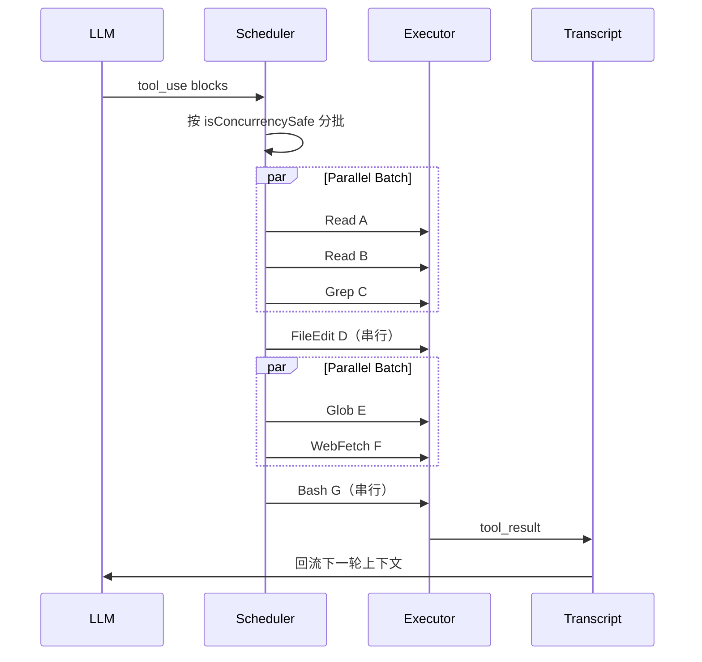

## Claude Code源码分析摘要

Claude Code价值在于Harness的设计，分为四个部分

1. Runtime 内核
2. 状态连续性
3. 安全与扩展
4. 思想总结

## Agent Runtime

用户输入不是发给模型，而是走一整条本地装配 -> 权限 -> 工具 -> memory的运行时链路

```javascript
ENTRY CHAIN
cli.tsx                         // CLI入口
    -> main.tsx                 // 主函数
    -> init + setup             // trust 前安全初始化
    -> lanchRepl()              // Ink + React启动，Ink 是一个“在终端里跑 React”的框架。
    -> App + REPL               // TUI与AppState （Read–Eval–Print Loop）
    -> query()                  // 执行核心循环
        -> api.stream(msgs)     // 调用Claude API
        -> runTools(...)        // 工具并发 + 权限 + hooks
        -> compact / hooks      // 轮次善后 + memory抽取
        -> tool_result 回灌     // 下一轮
```

trust 前安全初始化主要是 检查当前目录是否可信，检查是否允许执行工具（文件写入、shell 等），初始化权限系统（类似 Cursor/Windsurf 的 sandbox）等

```javascript
main.tsx (主逻辑伪代码)

async function main(argv) {
    await init(argv)                        // trust 前安全初始化
    if (argv.print) return runHeadless()    // no GUI mode
    if (argv.bridge) return runBridge()     // IDE Plugin
    if (argv.remote) return runRemote()     // SSH, cloud mode
    // 默认路径：完整runtime
    const tools = getTools(permCtx)
    const mcp = await getMcpTools()
    const skills = initBundledSkills()
    const agents = getAgentDefs()
    await initTelemetryAfterTrust()         // 运行时事件上报系统，用于Claude Code团队进行优化，可以理解为Spring的AOP cross-cutting concern
    await launchRepl(...)
}
```

所有的运行形态 (REPL/headless/SDK/bridge/remote/subagent)都共用一条Query()内核实现

## Query Loop

6个phase + AsyncGenerator背压，让长会话在错误，超限，中断下都能继续

```javaScript
query.ts

async functions* query(state) {
    while (true) {
        yield* preApiPhase(state)                       // 1. 装配attachments / skills / memory
        const res = yield* apiRequestPhase(state)       // 2. 流式传输API + 重试
        const t = yield* processResponse(res, state)    // 3. 解析 -> Transition
        if (t === 'tool_use') yield* executeTools(state)// 4. 并发 + 权限 + hooks
        if (shouldStop(t)) yield* runStopHooks(state)   // 5. 轮次后钩子
        if (shouldExit(t)) break                        // 6. 判断结束
        state.turnCount++
    }
}
```

state = 当前 REPL 的完整上下文（messages、tools、turnCount、memory 等）

transition = LLM 输出后，runtime 应该采取的下一步动作

输出是流式输出，在前端展示的时候，下一步已经调用了，所以使用起来会很流畅

**以下是Transition的状态：**
```
continue            正常进入下一轮
tool_use            有工具执行
end_turn            模型主动结束
stop_sequence       命中 stop seq
max_tokens          触发输出上限
error_recovery      进入错误恢复
budget_exceeded     预算/递减收益
abort               用户取消
```

### 七级错误恢复级联

```
L1: Streaming fallback
// 流式回退：如果流式输出中断（网络抖动、模型中断），切换到非流式一次性请求继续完成当前轮次。

L2: Collapse
// 上下文折叠：自动压缩 messages（如合并历史、移除冗余、缩短工具日志）以减少 token 压力，避免因上下文过大导致失败。

L3: Reactive compact
// 反应式压缩：在模型返回错误或不完整输出时，立即对上下文进行更激进的压缩（删除旧轮次、裁剪长内容），然后重试。

L4: Max output escalation
// 最大输出升级：如果模型因为 max_tokens 限制而中断，自动提高 max_tokens 或切换到更大预算的模式重新请求。

L5: Multi-turn continue
// 多轮续写：如果模型输出被截断或逻辑未完成，自动发起“继续（continue）”请求，让模型从断点继续生成。

L6: Stop hook blocking
// 停止钩子阻断：如果 stop_sequence 或 end_turn 提前触发，阻断 stop 钩子，让模型继续生成直到任务完成。

L7: Budget continuation
// 预算续航：如果触发预算限制（如递减收益、成本上限），进入低成本模式继续执行（如缩短上下文、降低频率）。
```

“永不轻易失败”的状态机 - 从轻到重的恢复链：

L1–L2：轻量恢复（网络/上下文问题）

L3–L4：中度恢复（模型输出不完整）

L5–L6：逻辑恢复（模型提前结束）

L7：预算恢复（成本/限制问题）

## TOOL运行时协议对象

Claude code对Tool定义为标准化的协议对象，而不是函数映射：安全并非在最外层套一个对象来保护，而是在内每个工具都要遵守

```js
// Tool 接口（src/Tool.ts，首脑大量可扩展）
type Tool = {
  name
  description()
  inputSchema
  call(input, context, canUseTool)

  // 运行时治理
  isReadOnly()
  isConcurrencySafe()
  checkPermissions()

  // UI / 结果如何回放
  renderToolUseMessage()
  mapToolResultToToolResultBlockParam()
}
```

```js
// buildTool（src/Tool，安全默认值）

const TOOL_DEFAULTS = {
  isEnabled: true,

  // 非默认并发，未声明则串行
  isConcurrencySafe: false,

  // 未声明则非只读
  isReadOnly: false,

  isDestructive: false,

  checkPermissions: allow,

  toAutoClassifierInput: '',

  userFacingName: name,
}

function buildTool(def) {
  return {
    ...TOOL_DEFAULTS,
    ...def,
  }
}
```

### 三：Tool不是函数映射，而是标准化协议对象

同一份定义同时服务：

- 模型调用
- 权限判断
- 并发调度
- UI 呈现
- 结果回流

---

### 接口到实例的关系

`Tool.ts` 定义完整运行时协议：

- 模型描述
- 输入 schema
- 执行函数
- 权限判断
- 并发属性
- UI 渲染
- 结果映射

具体工具在各自文件中声明 `ToolDef`，例如：

- `BashTool`
- `FileReadTool`
- `TodoWriteTool`

这些定义提供工具特化逻辑。

`buildTool` 只补齐 `DefaultableToolKeys`。

---

### 设计含义

工具作者关注“特化行为”：

公共默认值集中在 `buildTool` 中维护。

展开顺序为：

```js
defaults -> def
```

因此具体工具的显式声明会覆盖默认值。

这使新增工具默认进入统一的：

- 权限机制
- 并发机制
- 显示机制
- 结果回流机制

## 四：Tool 执行：受治理的执行管线

> Tool 协议只有进入调度器，才真正变成可控、可并发、可回写 transcript 的行动

---

### Tool call 完整链路

```js
// 模型输出 assistant message
//   ↓ 含一个或多个 tool_use blocks

query.ts 收集 tool_use

//   ↓

toolOrchestration.ts 按 isConcurrencySafe 分批

//   ↓

toolExecution.ts 逐个执行

//   ├─ schema 校验
//   ├─ validateInput
//   ├─ pre-tool hooks
//   ├─ permission / ask / deny
//   ├─ tool.call()
//   ├─ tool_result / attachment / progress
//   └─ 规范化为 user-side tool_result messages

//   ↓

下一轮 API 调用回流 transcript
```

### 工具并发执行策略



### 执行细节

- （1）工具池由 getTools() / assembleToolPool()组成， 内建工具与 MCP 工具合并后进入执行链。
- （2）并发批次中的contextModifier延迟收集，待整个 batch 收口后统一 apply，避免上下文竞争。
- （3）StreamingToolExecutor 以queued -> executing -> completed -> yielded跟踪状态，边接收流式 `tool_use`，边启动可并行工具。

---


